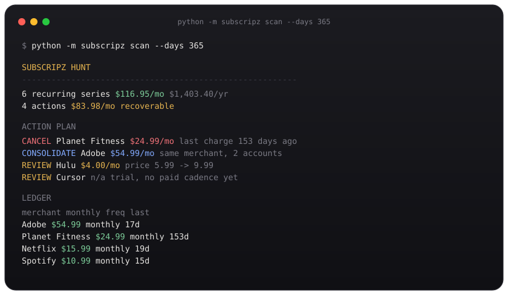

<div align="center">
  
  <h1>subscripz</h1>
  <p><strong>Find the subscriptions you forgot you were paying for.</strong></p>
  <p>Apple Mail in. A cancel list out. Nothing leaves your Mac.</p>
  <p>
    
    
    
  </p>
  <br>
  
</div>

<br>

It does not grep for the word `payment`. It looks for the **same merchant, similar amount, regular interval** — then ranks what to cancel, consolidate, or review.

```bash
python -m subscripz scan --days 365
```

<p align="center">
  <em>Local &nbsp;·&nbsp; no bank login &nbsp;·&nbsp; no upload &nbsp;·&nbsp; read-only mail index</em>
</p>

## Install

macOS, Python 3.12, Apple Mail with messages downloaded. Give Terminal **Full Disk Access**.

```bash
git clone https://github.com/ogprotege/subscripz-buster.git
cd subscripz-buster
curl -LsSf https://astral.sh/uv/install.sh | sh
uv sync
```

```bash
uv run python -m subscripz scan --days 365
```

<details>
<summary>venv instead of uv</summary>

```bash
python3 -m venv .venv
source .venv/bin/activate
pip install -r requirements.txt
python -m subscripz scan --days 365
```

Stay on the lockfile. `pip install -U mcp` breaks the MCP server.

</details>

## Commands

```bash
python -m subscripz scan --days 365
python -m subscripz scan --output-json hunt.json --quiet
python -m subscripz scan --dry-run
python -m subscripz scan --source messages --messages charges.json --format json
```

<details>
<summary>Flags</summary>

```
--days N                         history window (default 365)
--dry-run                        count hits, do not cluster
--output-json PATH               write the full result
--quiet                          no stdout
--format json                    JSON on stdout
--mail-db PATH                   Envelope Index, or SUBSCRIPZ_MAIL_DB
--source messages --messages FILE
--min-confidence 0.28            drop weak series
```

Exit codes: `0` ok · `1` runtime · `2` missing source / usage.

Fixture shape:

```json
[
  {
    "subject": "Your Netflix subscription has been renewed — $15.99/month",
    "sender": "noreply@netflix.com",
    "recipient": "me@example.com",
    "date_received": "2026-08-01T00:00:00"
  }
]
```

</details>

## What the actions mean

**Cancel** — last charge is older than ~1.6 billing cycles. Confirm it is dead, or you are still paying.  
**Consolidate** — same merchant on more than one of your addresses.  
**Review price** — latest charge jumped 20% or more.  
**Review trial** — trial mail, no paid cadence yet.

Amounts have to appear in the subject or snippet. Apple Mail’s Envelope Index does not store bodies.

## Claude

`server.py` is a local MCP server. Use `hunt_recurring_charges` and `subscription_action_plan`.

```json
{
  "mcpServers": {
    "subscripz": {
      "command": "/ABS/PATH/subscripz-buster/.venv/bin/python",
      "args": ["/ABS/PATH/subscripz-buster/server.py"]
    }
  }
}
```

## Empty hunt

Mail downloaded · Terminal has Full Disk Access · `--days 730` · `--dry-run` · `--mail-db "$HOME/Library/Mail/V10/MailData/Envelope Index"`

```bash
uv run pytest tests/
```

MIT. The 17-option menu is leftover. This is the product.
